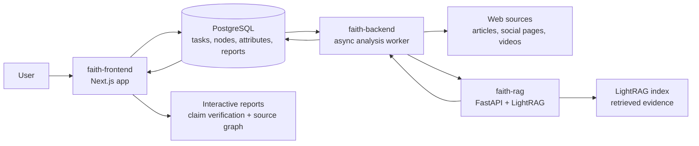

# FAITH

FAITH is a full-stack misinformation analysis platform for tracing how claims move through online sources and verifying extracted factual statements with retrieval-augmented generation.

The project combines a web interface, an asynchronous analysis worker, and a dedicated RAG verification API. Together, they let a user submit a source URL, expand related sources into a traceable graph, extract signals such as credibility and factual claims, and generate a verification report backed by indexed evidence.

## Component Repositories

| Repository | Role | Stack |
| --- | --- | --- |
| [faith-frontend](https://github.com/kinhei/faith-frontend) | User interface, authentication, graph visualization, report views, and Prisma-backed application data | Next.js, React, Prisma, PostgreSQL |
| [faith-backend](https://github.com/kinhei/faith-backend) | Async worker for scraping, source expansion, analysis pipelines, claim extraction, and report orchestration | Python, SQLAlchemy, PostgreSQL, Playwright, spaCy |
| [faith-rag](https://github.com/kinhei/faith-rag) | Retrieval-augmented claim verification API used by the backend report workflow | FastAPI, LightRAG, SQLAlchemy, JWT |
| [faith-model](https://github.com/kinhei/faith-model) | NELA-GT-2018 model-training workflow, feature extraction notebooks, and exported calibrated classifier | Python, Jupyter, scikit-learn, XGBoost |

## Architecture



## How It Works

1. A user submits a URL through the frontend.
2. The backend worker locks pending tasks from PostgreSQL and scrapes the source content.
3. Expansion modules discover related URLs and build a source tree.
4. Analyzer modules extract credibility, linguistic, sentiment, readability, and factual-claim signals.
5. When a source tree finishes processing, the backend sends extracted claims to `faith-rag`.
6. `faith-rag` retrieves supporting or conflicting evidence from the indexed content.
7. The frontend displays the source graph and pre-computed verification report.

## Technical Highlights

- Built a multi-service architecture with separate frontend, backend worker, and RAG API repositories.
- Designed an async Python worker using database row locking to process queued source nodes safely.
- Implemented modular scraping, expansion, and analyzer pipelines for extensible misinformation analysis.
- Integrated retrieval-augmented generation with LightRAG for evidence-backed claim verification.
- Modeled misinformation propagation as a graph/tree that can be visualized in the web interface.
- Used PostgreSQL as the shared state layer for tasks, source nodes, attributes, and reports.

## Running Locally

Each service is currently run from its own repository.

### 1. Frontend

```bash
git clone https://github.com/kinhei/faith-frontend.git
cd faith-frontend
cp .env.example .env
yarn
yarn dev
```

The app runs at `http://localhost:3000`.

### 2. Backend Worker

```bash
git clone https://github.com/kinhei/faith-backend.git
cd faith-backend
cp .env.example .env
uv sync
uv run playwright install
uv run python src/main.py --continuous
```

Set at least `DATABASE_URL` and the API keys required by the enabled analyzers and expanders.

### 3. RAG Verification API

```bash
git clone https://github.com/kinhei/faith-rag.git
cd faith-rag
cp .env.example .env
uv sync
uv run fastapi dev src/main.py
```

The backend calls this service when a processed source tree is ready for claim verification.

## Screenshots And Demo

Screenshots and demo media can be added here once the deployed interface or local demo captures are available.

Suggested assets:

- Source graph visualization.
- Claim verification report.
- Submitted URL task view.
- RAG chat or evidence retrieval view.

## Roadmap

- Add a top-level Docker Compose workflow for running the full system together.
- Add screenshots and a short demo GIF.
- Add deployment notes for a public demo environment.
- Add a concise system design document for recruiters and technical reviewers.
