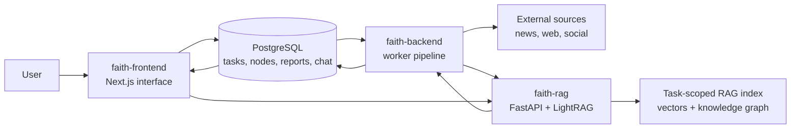

# FAITH: FAlse-Information Tracer & Harvester

FAITH is a full-stack misinformation analysis platform that turns a submitted URL
into an evidence-backed credibility report, an explorable propagation graph, and a
source-referenced RAG chat workspace.

## One-Minute Demo

<video src="./Faith_IntroVideo.mp4" controls width="100%"></video>

[Open the demo video](./Faith_IntroVideo.mp4)

## Why FAITH

Modern misinformation detectors can achieve strong benchmark accuracy, but many
remain difficult to trust in real fact-checking work: they produce opaque verdicts,
focus on a single content item, and give users little visibility into how a claim
travels across sources. FAITH was designed around a different goal: make every
automated verdict inspectable.

The system combines automated scraping, evidence expansion, linguistic and
credibility analysis, calibrated ML scoring, knowledge graph visualization, and
retrieval-augmented generation. Instead of asking users to accept a black-box label,
FAITH shows the score, the contributing signals, the related sources, and the
evidence behind each verified claim.

## Key Design

### 1. Evidence Graph Instead Of Single-Page Analysis

FAITH starts from one submitted URL, scrapes the root content, and expands outward
to related evidence using search-based expanders. Each discovered source is stored
as a child node, creating a directed task graph that shows how supporting or
contradicting sources relate to the original article.

Users can inspect the graph in both hierarchical and radial layouts, open node
details, and move between source evidence and generated reports without leaving
the task workspace.

### 2. Dependency-Aware Analyzer Pipeline

The backend runs a modular analyzer pipeline over each scraped node. Independent
analyzers run in parallel, while dependent analyzers wait only for the specific
signals they need. This keeps the pipeline extensible without forcing every
analysis step into a slow linear sequence.

Analyzer families include:

| Family | Example Signals |
| --- | --- |
| Linguistic and sentiment | positive sentiment, negative sentiment, subjectivity |
| Stylometric and structural | readability grade, language quality, AI-generation probability |
| Fact-checking | extracted factual claims, cross-reference verdicts |
| Source credibility | domain and infrastructure credibility signals |

### 3. Transparent Trust Score

The final decision analyzer converts eight inference-time features into a calibrated
trust probability using an XGBoost classifier trained on NELA-GT-2018. The output
is scaled into a FAITH Trust Score from 0 to 100.

The selected model uses only signals the pipeline can compute from the submitted
content, so the score remains explainable and reproducible:

| Feature | Source |
| --- | --- |
| `content_positive_score` | Sentiment analyzer |
| `content_negative_score` | Sentiment analyzer |
| `content_subjectivity` | Subjectivity analyzer |
| `title_subjectivity` | Subjectivity analyzer |
| `manipulation_risk` | Emotional manipulation analyzer |
| `readability_grade` | Readability analyzer |
| `language_quality` | Language quality analyzer |
| `clickbait_score` | Clickbait detector |

The system intentionally uses three verdict zones: `REAL`, `FAKE`, and
`UNCERTAIN`. The uncertain band is a design choice, not a failure state. FAITH
only gives a definitive automated verdict when the model reaches a precision
target; ambiguous cases are deferred for human review.

### 4. RAG-Backed Claim Verification

FAITH extracts independently verifiable claims from the root article and checks
them against the child-node evidence graph through a dedicated RAG microservice.
The same RAG service powers an interactive chatbot, allowing users to ask follow-up
questions over the assembled evidence.

Responses include source references that map back to graph nodes, so users can
open the cited article content and inspect the basis of the answer.

### 5. Concurrent, Recoverable Backend Worker

The Python backend is designed for multi-user task processing. Workers claim
pending nodes atomically, process scrape-expand-analyze stages with bounded
concurrency, and recover stale processing jobs that were interrupted mid-run.
This allows multiple analysis tasks to progress without duplicate claims or silent
task loss.

## Architecture



## User Workflow

1. Sign in with a stateless email OTP flow.
2. Submit a URL or text for analysis.
3. The backend scrapes the source, expands related evidence, and analyzes each
   node.
4. The graph viewer shows the evolving evidence tree.
5. The report viewer presents the trust score, analyzer breakdown, fact-check
   results, verified factual statements, and generated summary.
6. The RAG chatbot lets users ask natural-language questions with source
   references.

## Model Evaluation

The model-training workflow is maintained separately in
[faith-model](https://github.com/kinhei/faith-model). The current classifier was
trained on NELA-GT-2018, a large multi-source news corpus with source-level
reliability labels aggregated from third-party evaluators.

After label cleaning, source filtering, and balanced sampling, the final training
dataset contains 46,755 articles with near-balanced classes:

| Split Detail | Count |
| --- | ---: |
| Reliable articles | 23,599 |
| Unreliable articles | 23,156 |
| Training samples | 37,404 |
| Validation samples | 9,351 |

Calibrated XGBoost achieved the strongest validation performance among the
tested models:

| Model | Accuracy | Macro F1 | ROC-AUC |
| --- | ---: | ---: | ---: |
| Logistic Regression | 67.00% | 0.669 | 0.727 |
| SVM | 68.45% | 0.683 | 0.751 |
| XGBoost | 69.86% | 0.698 | 0.774 |

For high-confidence predictions, FAITH uses a two-threshold decision framework:

| Zone | Probability Range | Verdict |
| --- | --- | --- |
| Fake zone | `P(reliable) < 0.3145` | `FAKE` |
| Uncertain zone | `0.3145 <= P(reliable) <= 0.7130` | `UNCERTAIN` |
| Real zone | `P(reliable) > 0.7130` | `REAL` |

On the confident subset, this produces approximately 80% precision while
deferring ambiguous articles to manual review.

## Component Repositories

| Repository | Role | Stack |
| --- | --- | --- |
| [faith-frontend](https://github.com/kinhei/faith-frontend) | User interface, authentication, graph visualization, report views, and chat workspace | Next.js, React, Prisma, PostgreSQL |
| [faith-backend](https://github.com/kinhei/faith-backend) | Scraping, expansion, analyzer pipeline, worker orchestration, and report generation | Python, SQLAlchemy, PostgreSQL, Playwright, spaCy |
| [faith-rag](https://github.com/kinhei/faith-rag) | Retrieval-augmented claim verification and source-referenced chat | FastAPI, LightRAG, SQLAlchemy, JWT |
| [faith-model](https://github.com/kinhei/faith-model) | NELA-GT-2018 model-training workflow, feature extraction notebooks, and exported classifier | Python, Jupyter, scikit-learn, XGBoost |

## Running Locally

Each service is run from its own repository.

### Frontend

```bash
git clone https://github.com/kinhei/faith-frontend.git
cd faith-frontend
cp .env.example .env
yarn
yarn dev
```

The app runs at `http://localhost:3000`.

### Backend Worker

```bash
git clone https://github.com/kinhei/faith-backend.git
cd faith-backend
cp .env.example .env
uv sync
uv run playwright install
uv run python src/main.py --continuous
```

Set `DATABASE_URL` and the API keys required by the enabled scrapers, expanders,
analyzers, and report-generation steps.

### RAG Verification API

```bash
git clone https://github.com/kinhei/faith-rag.git
cd faith-rag
cp .env.example .env
uv sync
uv run fastapi dev src/main.py
```

The backend uses this service for per-claim verification and report summaries; the
frontend uses it for source-referenced chat.

## Current Limitations

- The trust-score model is trained on English-language article-length news from
  NELA-GT-2018. Scores for short-form social media content should be interpreted
  cautiously.
- The current verdict taxonomy is `REAL`, `FAKE`, and `UNCERTAIN`; future work
  can extend this into multi-label categories such as satire, conspiracy,
  clickbait, selective omission, and AI-generated propaganda.
- A content-type-aware scoring pipeline would improve reliability across news,
  social posts, and other media formats.

## Project Goal

FAITH is built to reduce the manual burden of fact-checking while keeping humans
in control. It helps users triage suspicious content, trace related sources, inspect
the reasoning behind a credibility score, and ask grounded follow-up questions
over the evidence collected for each analysis task.
